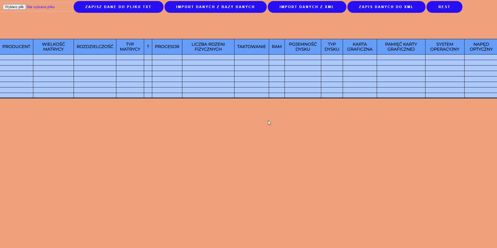
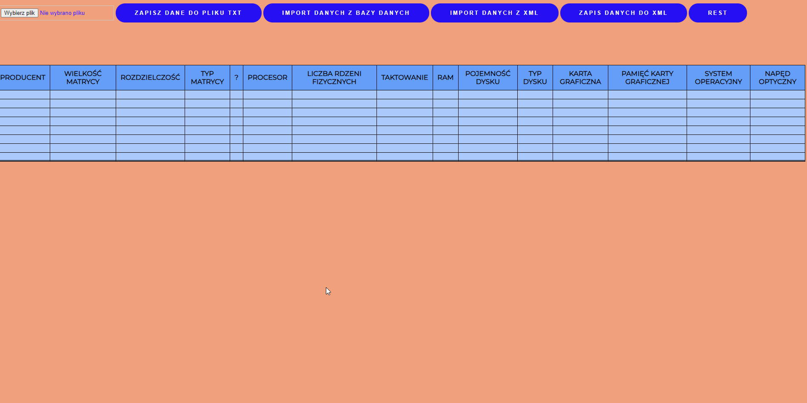

# Table1

A project that I made for my university lecture. It contains such functionalities as (operated on the table):
- loading data from a text file
- saving data to a text file
- loading data from the database
- loading data from XML file
- saving data to XML file
- loading data about the manufacturer's founder and the date of establishment from a locally placed server containing data from a JSON file

# Setup
Update info about database in main.js. 

# Start application
You can launch local server based on index.html file. To run local server with JSON file, type in terminal (while being in root folder):
```bash
json-server --watch db.json
```
## Used technologies
* SASS
* Firebase
* Json-server

## Usage
<p align="center">



</p>
